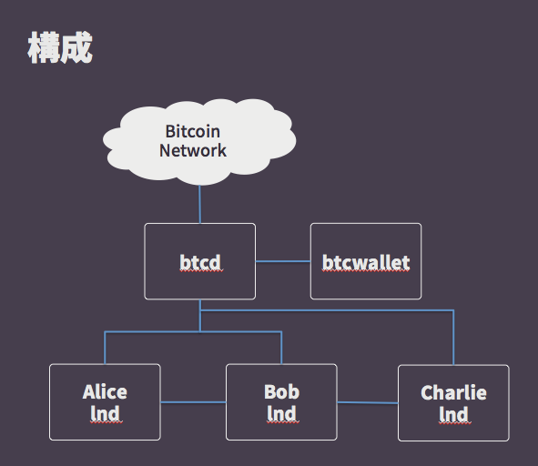

# 動かして学ぶFull Node + Wallet + Payment Channel


### achiku

- https://github.com/achiku


### 質問

- Full Nodeをmainnet運用した事があるという人
- Full Nodeをtestnetで運用した事があるという人
- SPV/Lightweight Clientを運用した事があるという人
- 秘密鍵管理するリアルなwallet持ってる人


### lightning network

- レイヤー2の価値移動方法
- オフチェーン(ブロックチェーンへの記載を遅らせて)価値移動
- 細かい単位でもconfを待たずに支払える
- 上記までがpayment channel/bi-directionaly payment channel
- bi-directional payment channelをネットワーク化してみんなが使えるようにしたもの
    * lightning network
    * BOLTという仕様があり大体できあがってて大量ノードでの実験等もはじまってる
    * 完全な分散じゃなくハブみたいなのはできるけどだいたい分散してる


### lightning networkの概要

- 今回動かす事と構成に焦点を置くためあまり立ち入った説明をしません
- その代わり最高の資料を載せます
    * https://lightning.network/
    * https://coincheck.com/blog/3984
    * https://bitcoinmagazine.com/articles/understanding-the-lightning-network-part-building-a-bidirectional-payment-channel-1464710791/
    * https://bitcoinmagazine.com/articles/understanding-the-lightning-network-part-creating-the-network-1465326903https://bitcoinmagazine.com/articles/understanding-the-lightning-network-part-creating-the-network-1465326903//


### btcd

- Full Blockchain Node
- https://github.com/btcsuite/btcd
- Goで書かれてる
- gRPC対応してる
- 企業のバックは一応ついているが一社のみ
    * coinbaseのエンジニアもコントリビュートしてるので内部では使われてる？
- Bitcoin Core (bitcoind)との差
    * 全ノードの7割はBitcoin Core (bitcoind)
    * walletの機能は分離されている
    * つまりNW的にwallet機能を隔離可能


### btcwallet

- Bitcoinのwallet
- https://github.com/btcsuite/btcwallet
- Goで書かれてる
- gRPC対応してる
- 企業のバックは一応ついているが一社のみ
    * coinbaseのエンジニアもコントリビュートしてるので内部では使われてる？
- SPV対応のissueも存在している
    * forkしてSPVになってるものもある
    * openbazarrのwalletはbtcwalletのfork
        * https://github.com/OpenBazaar/spvwallet
    * https://github.com/btcsuite/btcwallet/issues/219
        * コントリビュートしたい
- ただし現状接続可能なfull nodeはbtcdのみ


### lnd

- Lightning Network用のNode
- https://github.com/lightningnetwork/lnd
- Goで書かれてる
- gRPC対応してる
- 企業バック有りだけど小さいしな
- 現状btcdと連携する事でlightning network deamonとして動く
- やっていってる人たち
    * https://angel.co/lightning
    * https://github.com/Roasbeef
    * https://github.com/josephpoon


### lncli-web

- http://github.com/mably/lncli-web
- nodeで書かれてる
- lndを操作するWebクライアント


### 環境構築

- ansible playbook
- https://github.com/achiku/ansible-playbook-lnd
    * あまりテストはできてないけど一通り必要なのは入ってる
    * os/ssh hardeningはしてないので以下等を使って各自やっていってほしい
        * https://github.com/dev-sec/ansible-os-hardening
        * https://github.com/dev-sec/ansible-ssh-hardening


### 構成




### Wallet (create wallet)

```
btcwallet --testnet --create
```


### Wallet (receive some tBTC)

- 以下のサイトに生成したアドレスを入れて送信
- https://testnet.manu.backend.hamburg/faucet
- https://www.blocktrail.com/tBTC/tx/ec260e7931e1c5a23d0521c5b6b4abef2542f08e4e29502dfdcc8af2668a8fa6

```
$ btcctl --testnet --wallet getnewaddress
msqABzDytH4hfsmb5ywRozEEStTfFCatSC
```

### ざっくりステップ

- bob/charlieとのネットワークを繋ぐ
- bob/charlie間でチャネルを開く
    * ここでコミットメントトランザクションができる
    * 二人がBTCを出し合ってdepositを作るイメージ
    * このチャネルはnetworkで承認されると使えるようになる
- bob/charlie間でbtcを送り合う
- bob/charlieのバランスを確認する
- bob/charlie間のチャネルを閉じる
    * このtxがnetworkに放出されてconfされるとお互いのunspent txになる


### lnd起動

```
-- alice
lnd --rpcport=10001 --peerport=10011 --restport=8001 --datadir=test_data --logdir=test_log --debuglevel=info \
  --no-macaroons --bitcoin.testnet  --bitcoin.active

-- bob
lnd --rpcport=10002 --peerport=10012 --restport=8002 --datadir=test_data --logdir=test_log --debuglevel=info \
  --no-macaroons --bitcoin.testnet --bitcoin.active

-- charlie
lnd --rpcport=10003 --peerport=10013 --restport=8003 --datadir=test_data --logdir=test_log --debuglevel=info \
  --no-macaroons --bitcoin.testnet --bitcoin.active
```


### LN (get basic info)

```
$ lncli-bob getinfo
{
    "identity_pubkey": "02654c7e9d2c0fc651630e069d4f5d44eb4197d48572e0c43da4e28515b8ff7a14",
    "alias": "",
    "num_pending_channels": 0,
    "num_active_channels": 0,
    "num_peers": 0,
    "block_height": 1202685,
    "block_hash": "000000006454d6a41d54563b1a11b460f195015fd2a97d0794475b96b9f89106",
    "synced_to_chain": true,
    "testnet": true,
    "chains": [
        "bitcoin"
    ]
}

$ lncli-alice getinfo
{
    "identity_pubkey": "0356337522f4aab0f7b0150e6914f08633b3fb2ac366759db41acb603bf41f026c",
    "alias": "",
    "num_pending_channels": 0,
    "num_active_channels": 0,
    "num_peers": 0,
    "block_height": 1202685,
    "block_hash": "000000006454d6a41d54563b1a11b460f195015fd2a97d0794475b96b9f89106",
    "synced_to_chain": true,
    "testnet": true,
    "chains": [
        "bitcoin"
    ]
}

$ lncli-charlie getinfo
{
    "identity_pubkey": "02b226448b5fbfee97cbf5db5b9d3c15c3ad5ca6dfa0cb9c20a49b96793d5d4c3b",
    "alias": "",
    "num_pending_channels": 0,
    "num_active_channels": 0,
    "num_peers": 0,
    "block_height": 1202685,
    "block_hash": "000000006454d6a41d54563b1a11b460f195015fd2a97d0794475b96b9f89106",
    "synced_to_chain": true,
    "testnet": true,
    "chains": [
        "bitcoin"
    ]
}
```

### LN (create network)

```
$ lncli-alice connect 02d0f890097011f21988d324727cf70c49c0a808283c68ca34ab2f0433a495852f@localhost:10012
{
    "peer_id": 0
}

$ lncli-alice listpeers
{
    "peers": [
        {
            "pub_key": "02d0f890097011f21988d324727cf70c49c0a808283c68ca34ab2f0433a495852f",
            "peer_id": 1,
            "address": "127.0.0.1:10012",
            "bytes_sent": "149",
            "bytes_recv": "149",
            "sat_sent": "0",
            "sat_recv": "0",
            "inbound": true,
            "ping_time": "0"
        }
    ]
}

$ lncli-bob listpeers
{
    "peers": [
        {
            "pub_key": "0304a0f5f0374cb95972a5f72af84a780c1674c237248e170f32c28291fc52e148",
            "peer_id": 1,
            "address": "127.0.0.1:38172",
            "bytes_sent": "175",
            "bytes_recv": "175",
            "sat_sent": "0",
            "sat_recv": "0",
            "inbound": false,
            "ping_time": "454"
        }
    ]
}
```


### LN (open channel)

```
$ lncli-alice walletbalance
{
    "balance": "50000000"
}

-- このタイミングでTXがネットワークに放出される
$ lncli-alice openchannel --node_key=02d0f890097011f21988d324727cf70c49c0a808283c68ca34ab2f0433a495852f --local_amt=5000000
{
        "funding_txid": "4e6a782303cbdedd182c8faae3e03c35d6de86018716effd16d95cab961e0af0"
}


$ lncli-alice listchannels
{
    "channels": [
        {
            "active": true,
            "remote_pubkey": "02d0f890097011f21988d324727cf70c49c0a808283c68ca34ab2f0433a495852f",
            "channel_point": "4e6a782303cbdedd182c8faae3e03c35d6de86018716effd16d95cab961e0af0:0",
            "chan_id": "1322567352680054784",
            "capacity": "5000000",
            "local_balance": "4991312",
            "remote_balance": "0",
            "commit_fee": "8688",
            "commit_weight": "600",
            "fee_per_kw": "12000",
            "unsettled_balance": "0",
            "total_satoshis_sent": "0",
            "total_satoshis_received": "0",
            "num_updates": "0",
            "pending_htlcs": [
            ]
        }
    ]
}
```


### LN (payment 1)

```
$ lncli-alice addinvoice --value=10000
{
        "r_hash": "a524f449eb0a207d0c6428f59d662298a7619c29da229f645db17e7034da6f4a",
        "pay_req": "lntb100u1pvaxnfkpp555j0gj0tpgs86rry9r6e6e3znznkr8pfmg3f7ezak9l8qdx6da9qdqqtqapwnmlyhkgctk72f9mgvrhudykl6vqdk7kd445xu070wy7yelyntlg8wlqn49mlq4cg7p3efqfd95feyn0r8ywam64pt65axl609cqhlpyzs"
}

$ lncli-bob sendpayment --pay_req=lntb100u1pvaxnfkpp555j0gj0tpgs86rry9r6e6e3znznkr8pfmg3f7ezak9l8qdx6da9qdqqtqapwnmlyhkgctk72f9mgvrhudykl6vqdk7kd445xu070wy7yelyntlg8wlqn49mlq4cg7p3efqfd95feyn0r8ywam64pt65axl609cqhlpyzs

-- これは失敗する


$ lncli-bob addinvoice --value=300
{
        "r_hash": "b7815cf61f45745d3ca3f8a5ede4f30fe72667e4e6931cf6846a35f6660b2b65",
        "pay_req": "lntb3u1pvaxnvxpp5k7q4easlg469609rlzj7me8nplnjvelyu6f3ea5ydg6lvest9djsdqqeklyrhkvanxg8567j6lrv6kj62dxfgch0h5v9p283vk5xrx70mj5s4wdatd38cxhss83zvm3ew708qvv9w46avnptvr6m5lkk3wly7qp6vvqws"
}

$ lncli-alice sendpayment --pay_req=lntb3u1pvaxnvxpp5k7q4easlg469609rlzj7me8nplnjvelyu6f3ea5ydg6lvest9djsdqqeklyrhkvanxg8567j6lrv6kj62dxfgch0h5v9p283vk5xrx70mj5s4wdatd38cxhss83zvm3ew708qvv9w46avnptvr6m5lkk3wly7qp6vvqws
{
        "payment_error": "",
        "payment_preimage": "44658bc08df97d1967e6c904dc4405886085c8b5da43a40d22a6cc32f8748e43",
        "payment_route": {
                "total_time_lock": 1203013,
                "total_amt": 300,
                "hops": [
                        {
                                "chan_id": 1322567352680054784,
                                "chan_capacity": 5000000,
                                "amt_to_forward": 300,
                                "expiry": 1203013
                        }
                ]
        }
}


$ lncli-alice sendpayment --pay_req=lntb5u1pvaxn0hpp5lr6zfjmgwv5kdcezwkshf2ujgat5w58620qqtqam4g8wr8x3wwjqdqqz3ls6mxhwd0jzxg3vk3rwqc5t2mvdpkfwg0xylkf8wnt0rwqpsxkkh329nz7p6nqk7ukaads5tjwha8c2plm6s5gt0pu9g63j0m0cjcqhdfnwl"

```


### LN (close channel)

```
$ lncli-alice closechannel --funding_txid=4e6a782303cbdedd182c8faae3e03c35d6de86018716effd16d95cab961e0af0 --output_index=0
{
        "closing_txid": "c78c9e0eb491378f579e1a3e20c8d34e89ec1986c295923efd5d1a884dbc7b88"
}


-- confirmされるまで少し待つ

$ lncli-alice walletbalance
{
    "balance": "49971824"
}
$ lncli-bob walletbalance
{
    "balance": "5000800"
}
```
